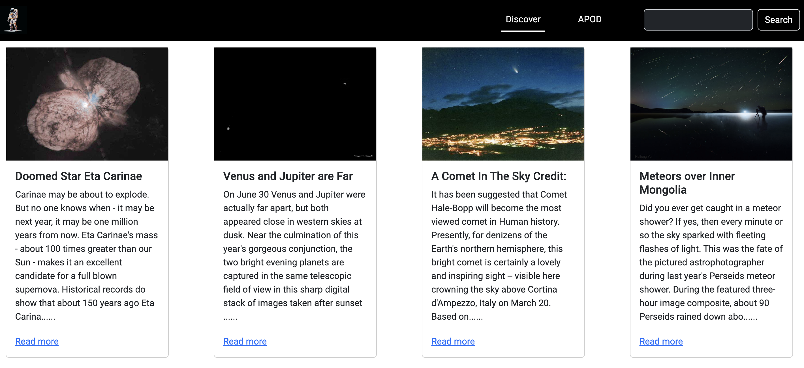

# Space-Lovers
This project is for lovers of the cosmos 😉—those who are fascinated by our vast universe and eager to learn more about it from NASA's experts. You can explore different cosmic events that have occurred, view the hand-selected Picture of the Day from our friends at NASA, and discover a variety of other breathtaking images they've curated.
Here is the [Link](https://elijah-cod.github.io/Space-Lovers/](https://space-lovers-qa8bzp0pu-elijahs-projects-702bf2c3.vercel.app/?#) to access the project.




## Discover
Every time the page loads, you'll see random, unique, hand-selected images from NASA.
```javascript
window.onload = async function (){
    const count = () => Math.floor(Math.random() * 60) + 1
    try {
        const response = await fetch(url + count())
        const data = await response.json()
        render(data)
    } catch (error) {
        console.error('Error:', error)
    }
}
```
### Capturing and Sending Data When the ‘Read More’ Link Is Clicked
In the various cards on display, you can learn more about a selected image by clicking the 'Read More' link, which will redirect you to a new page with additional details. 
```javascript
 window.open("explanation.html", "_blank");
```
This is achieved by creating an object of data to be shared between the two pages using local storage.
```javascript
const moreDetails = {
        title: element.title,
        image: element.url,
        description: element.explanation,
        date: element.date
    }
localStorage.setItem("details", JSON.stringify(moreDetails))
```
### Receiving and Outputting the Data From the ‘Read More’ Link
1. First we get the object from the local storage
```javascript
const readMore = localStorage.getItem("details")
```
2. Then we change the json string to an object
```javascript
const moreDetails = JSON.parse(readMore);
```
3. Finally we add the object on the DOM
```javascript
document.body.innerHTML = `
            <h1>Space Lovers👽</h1>
            
            <h2>${moreDetails.title}</h2>
            <p>${moreDetails.description}</p>
            <p class="date"><strong>DATE: </strong>${moreDetails.date}</p>
            `
```
## APOD
Astronomy Picture of the Day is the section where we feature the image selected by NASA as the Picture of the Day. It is updated daily

## Search
Here, users can search for various planetary events and space-related topics, and we provide videos related to their search. 
* We accomplished this by adding an event listener to the search button, which captures the user's input.
```javascript
if (searchItem) {
        fetch(url)
            .then(response => response.json())
            .then(data => {
                displaySearch(data.collection.items)
            })
    }
```
* Next, we checked if the returned data included any videos.
```javascript
if (item.data[0].media_type === "video") {
            fetch(item.href)
                .then(response => response.json())
                .then(video => {
                    createVideoPlayer(video, item)
                })
        }
```
* The captured data is then filtered to return an array of MP4 links, which we use to update the DOM.
```javascript
    const videoLink = vids.filter(data => data.endsWith('.mp4'))
    const video = document.createElement('video');
    video.src = videoLink[0];
    video.width = 640; 
    video.controls = true; 
```
## API Reference
* Get random images using count
```http
https://api.nasa.gov/planetary/apod&count
```
* Get the picture of the day
```http
https://api.nasa.gov/planetary/apod
```
* Use the search function to retrieve content related to the items.
```http
https://images-api.nasa.gov/search
```
